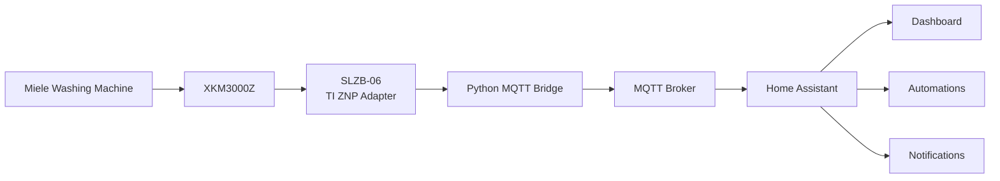

# Miele XKM3000Z Local Zigbee Bridge for Home Assistant

## Documentation

- [Full protocol documentation](docs/Miele_XKM3000Z_Protokoll_Dokumentation_final.md)
- [Home Assistant examples](homeassistant/)
- [Docker example](examples/docker-run.sh)

Reverse-engineered local integration for older Miele washing machines with XKM3000Z Zigbee communication module, tested with a Miele WPS 820 generation appliance.

This repository focuses only on the Miele XKM3000Z module, its local Zigbee telemetry, selected write experiments, MQTT publishing, and Home Assistant discovery. It intentionally does not cover any separate smart-home gateway migration topic.


## Current status

Working / confirmed:

- Local readout through a Texas Instruments ZNP-compatible Zigbee adapter.
- MQTT publishing with Home Assistant MQTT discovery.
- Status decoding: off, ready, delay start, running, finished, fault, cancelled, service test mode.
- Program decoding for known program IDs.
- Remaining time and start delay decoding.
- Start now via confirmed delay-start reset to 0 minutes.
- Door open/closed events via raw event cluster `0x0B02`.
- Fault/alarm recognition via `status_code=8` and phase byte `B0=0x0A`.
- Water inlet fault candidate via `status_code=8`, `B0=0x0A`, `B1=4`.
- Parameter block decoding for current drum speed and max spin speed.
- Water Plus availability for the selected program.

Experimental / not confirmed:

- Program selection writes.
- Pause/cancel control commands.
- Short option bit.
- Direct temperature readout.
- Direct NTC, float switch, lock-state and actuator-state readout.
- Service diagnostic container `FD01/0x0020`, which currently returns `0x8F`.

## Architecture

```text
Miele washing machine + XKM3000Z
        │ Zigbee
TI ZNP adapter / TCP serial bridge
        │
Python bridge
        │ MQTT
Home Assistant MQTT discovery
```



## Quick start

Copy the repository into your Zigbee2MQTT/docker work folder or mount it into a Python container.

Example:

```bash
docker run --rm -it --network host \
  -v /volume2/docker/zigbee2mqtt:/work \
  -e MIELE_ZNP_HOST=192.168.xxx.xxx \
  -e MIELE_ZNP_PORT=xxx \
  -e MIELE_TARGET_NWK=0x537D \
  -e MQTT_HOST=192.168.xxx.xxx \
  -e MQTT_USER='your mqtt User' \
  -e MQTT_PASS='your-password' \
  python:3.12-alpine \
  sh -c "apk add --no-cache mosquitto-clients && python /work/src/miele_gateway_mqtt.py"
```

## Environment variables

| Variable | Default | Meaning |
|---|---:|---|
| `MIELE_ZNP_HOST` | `192.168.178.101` | TCP host of the ZNP adapter |
| `MIELE_ZNP_PORT` | `6638` | TCP port of the ZNP adapter |
| `MIELE_TARGET_NWK` | `0x537D` | Zigbee NWK address of the Miele module |
| `MQTT_HOST` | `192.168.178.56` | MQTT broker host |
| `MQTT_USER` | `mqtt` | MQTT username |
| `MQTT_PASS` | empty | MQTT password |
| `MQTT_BASE` | `miele_xkm3000z` | MQTT topic base |
| `MIELE_POLL_INTERVAL` | `30` | Poll interval in seconds |
| `MIELE_ENABLE_TIME_SYNC` | `true` | Enable Zigbee Time Cluster sync |

## Important findings

### Status codes

| Code | Meaning |
|---:|---|
| `1` | off |
| `3` | ready |
| `4` | delay start active |
| `5` | running |
| `7` | finished |
| `8` | fault/alarm |
| `9` | cancelled |
| `12` | service test mode |

### Program phase byte B0 / `phase_a`

| B0 | Meaning |
|---:|---|
| `1` | off |
| `2` | init / wakeup |
| `3` | normal on |
| `4` | shutdown transition |
| `7` | special state, observed with service test mode |
| `10 / 0x0A` | fault / alarm |

### Water inlet fault candidate

A water inlet fault is not only inferred from `phase_b=4`; the corrected rule is:

```text
status_code = 8
phase_a / B0 = 0x0A
phase_b / B1 = 4
```

This identifies a fault/alarm in the washing/water-inlet context. A specific internal Miele F-code was not observed over Zigbee.

### Door events

The raw event cluster is `0x0B02`.

Observed values:

| Payload ending | Meaning |
|---|---|
| `... 00 01 00` | door closed |
| `... 00 11 00` | door open |
| `... 02 01 00` | door closed in another runtime/service context |
| `... 02 11 00` | door open in another runtime/service context |

A separate locked/door-lock state has not been found yet.

### Parameter block

The parameter block contains several useful fields:

- B5 = current drum speed in `rpm / 10`.
- B6/B7 = max spin speed, big endian.
- Water Plus bit = availability of Water Plus in the current program.
- Short bit = unresolved candidate; no reliable state change observed.

### Time sync

The bridge keeps Zigbee Time Cluster sync enabled by default. The appliance interacts with cluster `0x000A`; delay-start behavior is expected to be more stable with a valid time base. Disable via:

```bash
-e MIELE_ENABLE_TIME_SYNC=false
```

## Repository layout

```text
src/miele_gateway_mqtt.py              Main MQTT/Home Assistant bridge
tools/miele_raw_aps_zcl_monitor.py     Passive raw APS/ZCL monitor
tools/miele_full_cluster_attribute_scanner.py  Read-only scanner for research
docs/protocol-notes.md                 Current protocol notes
examples/docker-run.sh                 Example container start
homeassistant/automation_finished.yaml Example finished notification automation
```

## Safety notes

This is research software. The bridge includes experimental write functions, but the productive integration is designed around readout and the confirmed start-delay write. Do not run multiple scanners/bridges against the same adapter at the same time.

## License

MIT. See `LICENSE`.

